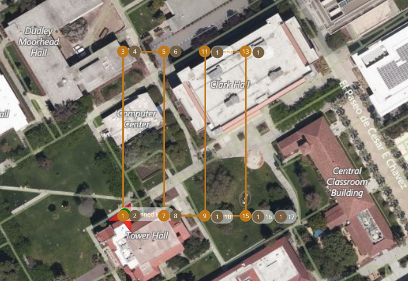

Basic code for a single-agent drone exploring & updating its belief space. Works with PX4 drone over mavsdk

```shell
git clone https://github.com/tomek-l/drone-scan.git
cd drone-scan
git submodule update --init --recursive
```

Start a physical drone and make sure there's a MAVLINK stream on udp:localhost:14550.
Alternatively, run a simulated drone:

```shell
docker run --rm -it --env PX4_HOME_LAT=37.335404 --env PX4_HOME_LON=-121.883400 --env PX4_HOME_ALT=488.0 jonasvautherin/px4-gazebo-headless:v1.9.2
```

Run mavproxy

```shell
mavproxy.py --master=udp:0.0.0.0:14550 --out=udp:localhost:14551 --out=udp:localhost:14552
```

Run the script
```
python3 main.py 
```

This will do a few things:

- start a wildfire simulation
- connect to the drone
- generate trajectory for the drone
- sample the space with a given interval

The drone will proceed to autonomously follow a grid trajectory and update it's belief about the simulated wildfire (stored in ```belief```)

